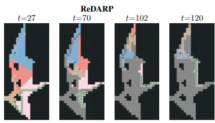

# **ReDARP: Adaptive Area Reallocation and Online Replanning for Multi-Robot Coverage**

### *Real-time multi-robot coverage with dynamic region redistribution*

<div align="center">

{: width="80%"}

</div>

---

## **Abstract**

Most multi-robot coverage planners assume uniform robot speeds and static
conditions, producing balanced offline decompositions but failing to adapt when
execution-time variations occur. We consider a more realistic scenario where the
environment and initial robot positions are known, yet robots may require
different times along their trajectories due to local findings. These
discrepancies create makespan imbalances, with some robots idling while others
finish. Existing online approaches offer local adaptability but lack
full-coverage and coordinated reallocation guarantees.

We address this by proposing **ReDARP**, an algorithm that monitors coverage
progress and dynamically rebalances regions when imbalance emerges. ReDARP
integrates balanced region decomposition, a multi-source BFS fallback, a
frontier-based local coverage module ensuring continuous progress, and an
adaptive *Robot-drop* mechanism that removes degenerate regions and optimizes
team size.

We prove coverage completeness and show that ReDARP maintains low computational
cost even under heavy repartitioning. Across three terrains and four team
sizes, ReDARP consistently achieves the lowest field and total time, outperforming
**MIP**, **MSTC\*** and **MFC** under identical disturbance patterns.

---

## **Highlights**
- Dynamic, real-time region redistribution  
- Fully coordinated multi-robot online replanning  
- Frontier-based continuous progress  
- Multi-source BFS fallback  
- Robot-drop mechanism for degenerate regions  
- Guaranteed full-coverage completeness  
- Low computational overhead under heavy disturbances  

---

## **Paper, Code & Video**

<div align="center">

[📄 Paper (coming soon)](#)  
[📦 Code (coming soon)](#)  
[🎥 Video (coming soon)](#)

</div>

---

## **BibTeX**

```bibtex
@article{.....,
  title={ReDARP: Adaptive Area Reallocation and Online Replanning for Multi-Robot Coverage},
  author={},
  year={2025}
}
